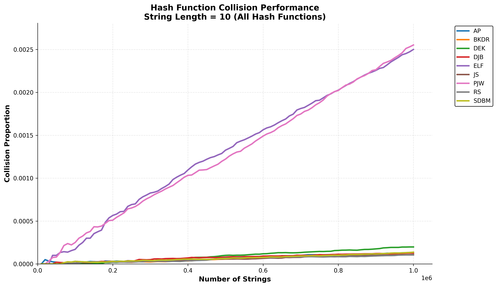
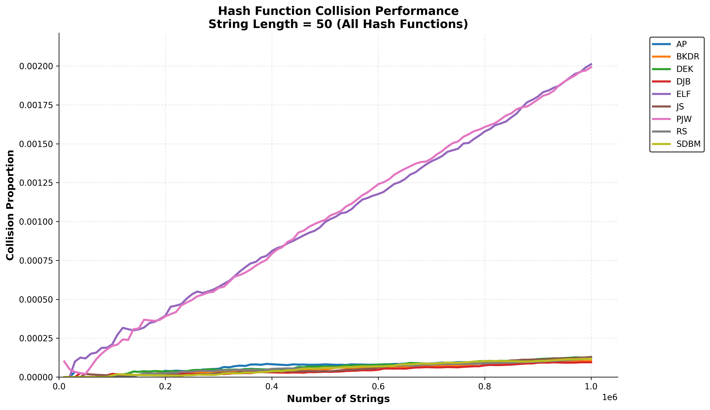
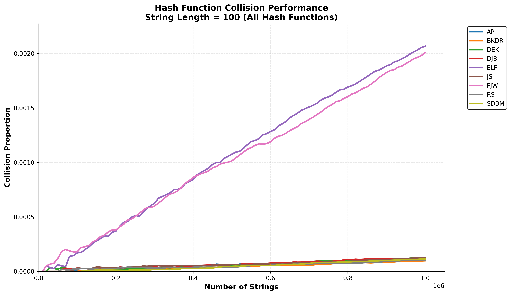
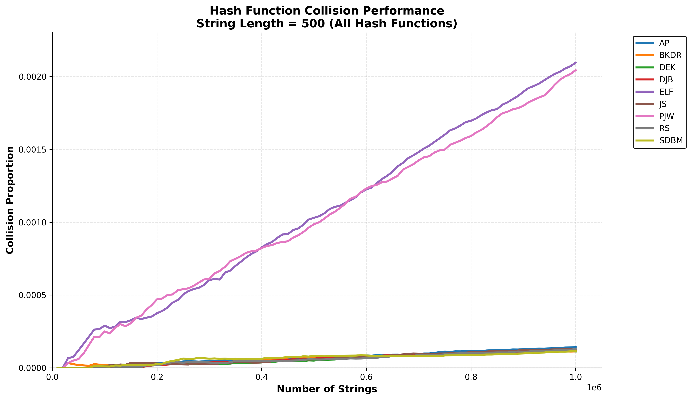
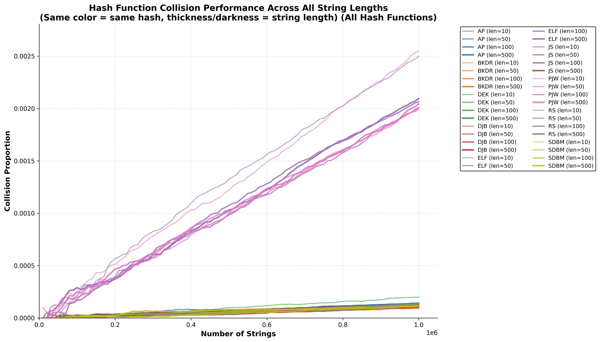
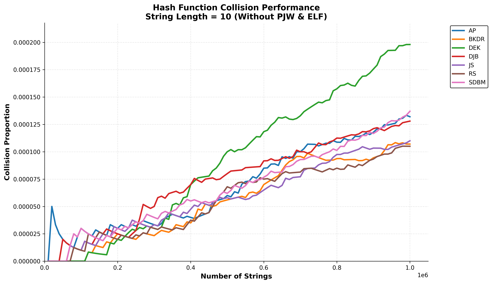
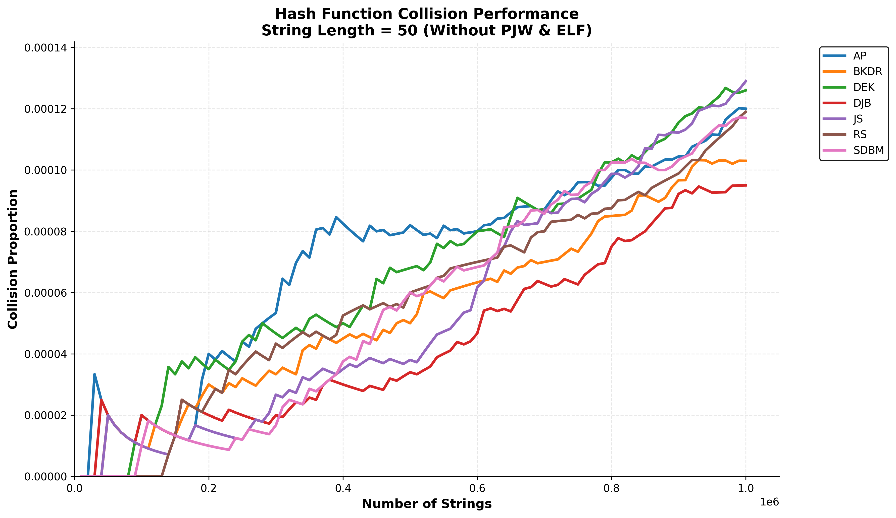
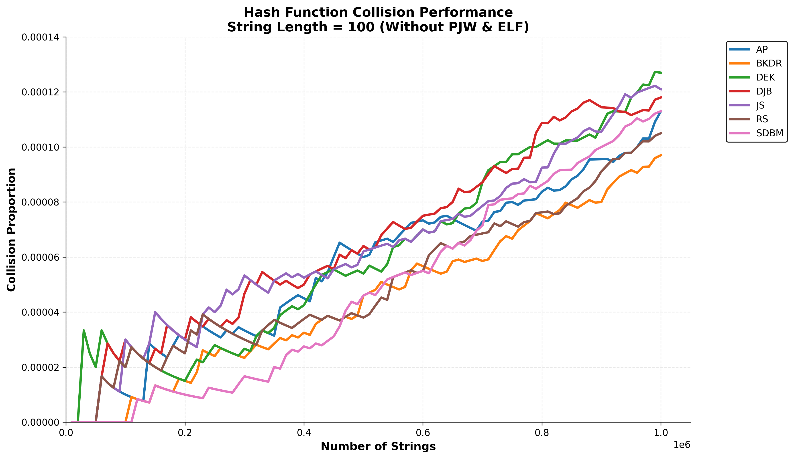
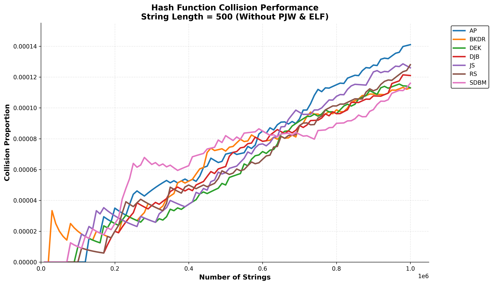
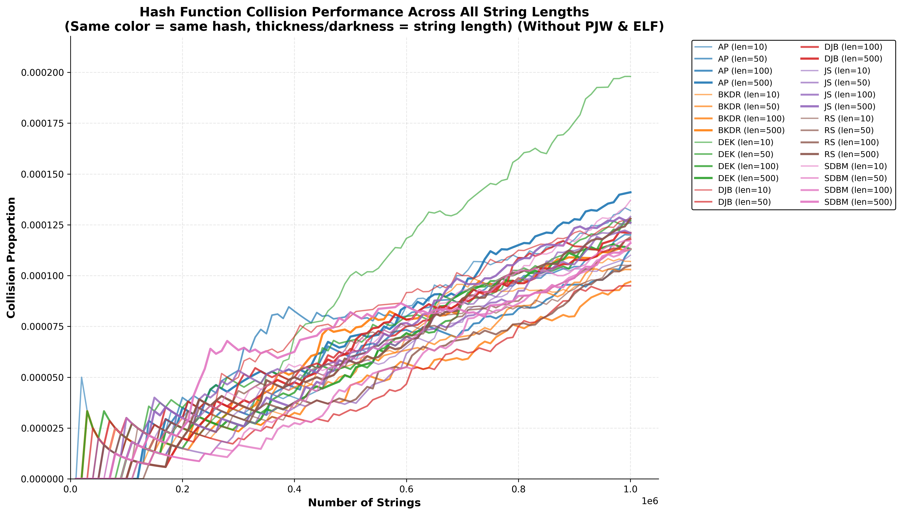

# Aim
- To study the dependence of collision proportion on number of strings and string length for various hash functions.

# Parameters
- All hash functions were taken from: https://www.partow.net/programming/hashfunctions/index.html
- ASCII strings a-z
- lengths = {10, 50, 100, 500}
- number of strings = 10^6
- no duplicate strings, for each dependence 
- all strings of same length, for each dependence

# Experiment
- 10^6 random unique strings of same length are generated 
- for each string a hash is computed
- if this hash was previously encountered then the count of collisions is increased by 1
- collision proportion = count of collisions / number of strings hashed so far
- a collision proportion vs number of strings hashed so far dependence is plotted

# Results
## All hash functions

- From the above four figures, __PWJ and ELF are consistently the worst__.

- All the different string lengths in the same plot: __longer strings produce less colissions__.

## Without PWJ and ELF
To produce more detailed look into the performance of the other hash functions.

- DEK's performance depends much more severely on the length of the string than others.
- DEK works the worst for length = 10, and it is within ordinary ranges for longer strings.
- The performance of each hash function for lengths longer than 10 is random, so no best or worst can be selected. If a conclusion were to be made then RS consistently
seems to be in the bottom part of the plots.  

# Conclusion
- Best: RF
- Worst: PWJ, ELF
- Longer strings for PWJ, ELF produce less collisions, while for other's no significant dependence is found.
- The proportion of collisions monotonically increase with number of strings. 
